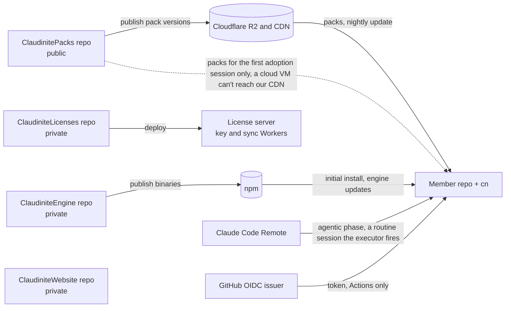
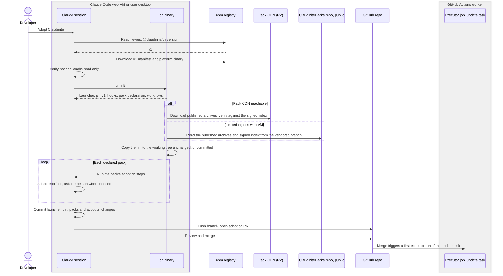
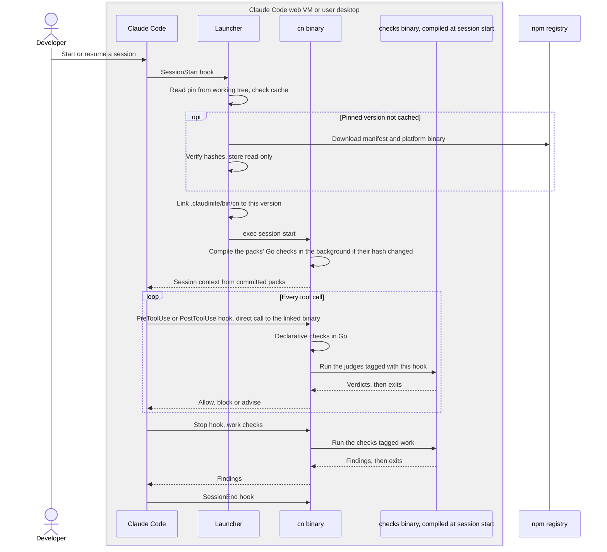
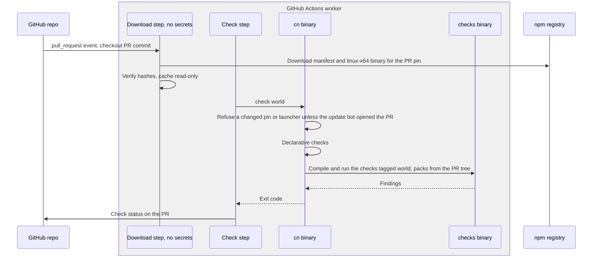
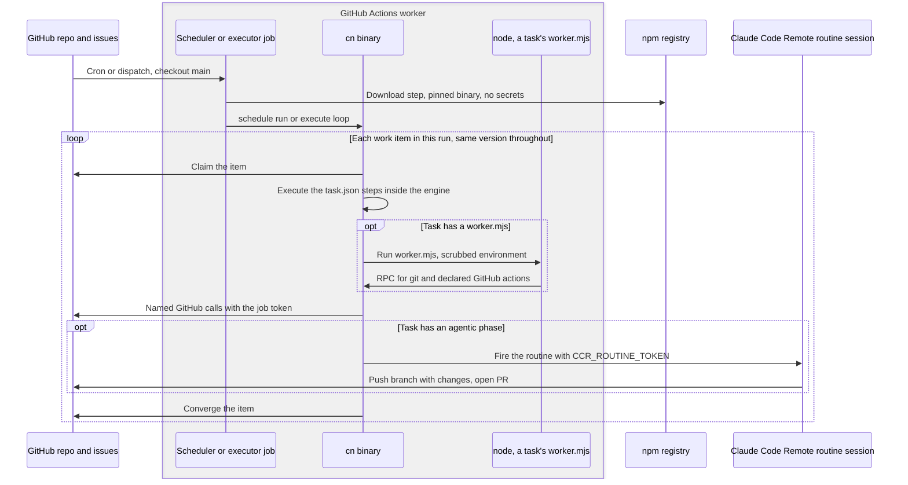
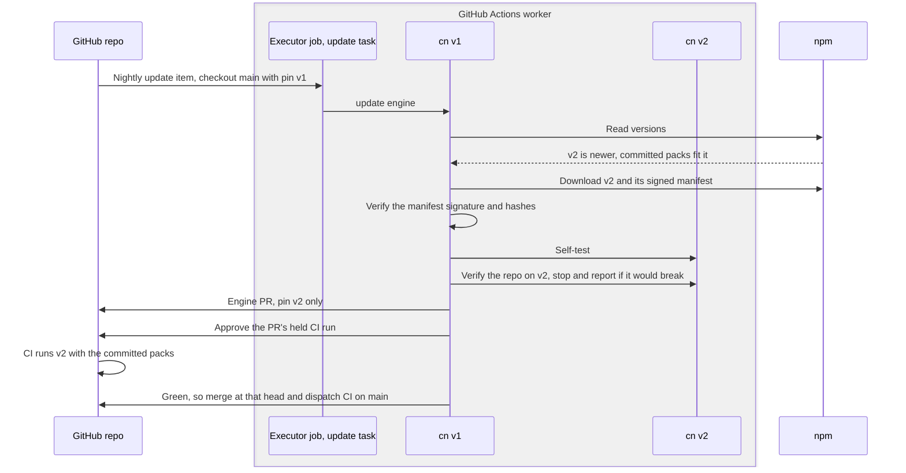
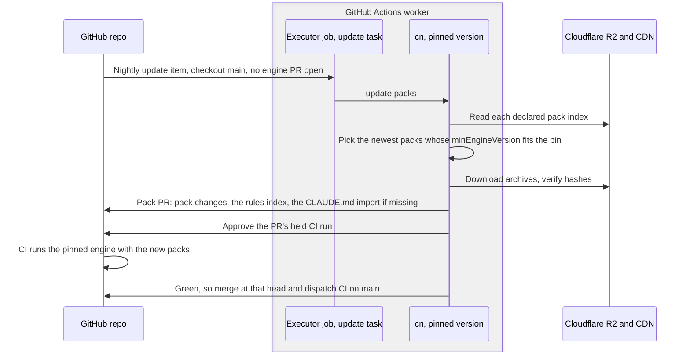
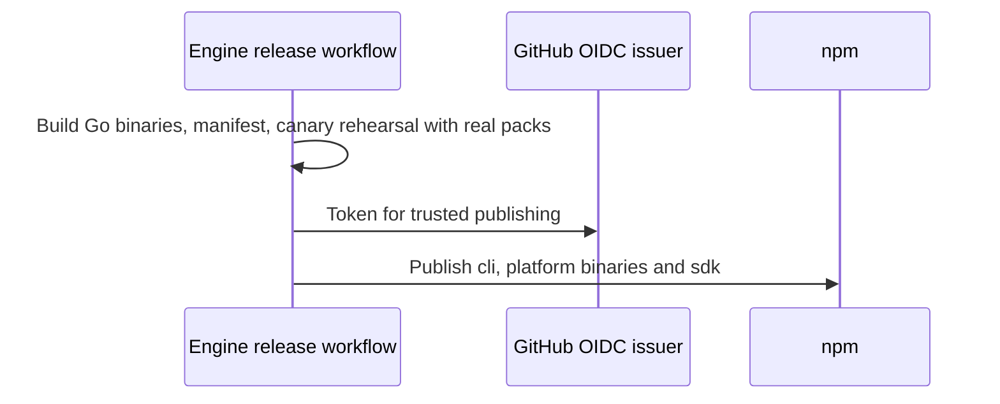

> Approved by Ariel on 2026-10-01. Source: [Claude Doc](https://claude.ai/code/artifact/0b92671a-39a4-4f36-ac26-8c81f4e9b5eb). This repo copy is now the canonical version; change it here.

# Claudinite as an executable: design

Sep 30, 2026 · @Ariel Raunstien

Claudinite's engine is one closed Go binary per platform, published on npm and pinned per repo by version and hash; packs stay Markdown plus JavaScript and are served as versioned archives from Cloudflare R2. Decisions, research, alternatives and the security review behind this design live in the [design record](https://claude.ai/code/artifact/aa875725-1401-45c2-bd6a-f6f7a121555d).

## Architecture and repositories

We build four repositories and run one service, the license server (a key Worker and a sync Worker); npm, GitHub, Cloudflare and Anthropic host the rest. The binary runs in two kinds of place, a Claude Code session (web VM or desktop) and a GitHub Actions job, and the engine asks a license of nothing: a fleet's sweeps, and any license check they make, are the fleet manager's own code (record row 145). Only Actions reaches R2 for a cloud member.



Each arrow is one actor delivering one thing. The engine update verifies the release's signed manifest.

| Repository | Visibility | Owns | Publishes to |
| --- | --- | --- | --- |
| ClaudiniteEngine | Private | Go source of the `cn` binary, including the task runner, growth and lifecycle and their built-in checks; the launcher; the JavaScript runner script, `@claudinite/sdk` and the public Go check SDK; the release workflow | npm (`@claudinite/cli`, platform packages, `@claudinite/sdk`), each release's manifest signed by a release key the embedded root certifies |
| ClaudinitePacks | Public | Pack sources (`RULES.md`, skills, `declared-checks.json`, `task.json`, coded checks in Go, task workers in `.mjs`); pack tests against a pinned engine; the pack release workflow | Cloudflare R2 behind the CDN |
| ClaudiniteWebsite | Private | The commercial website, the single-repo dashboard and other lower-criticality website work | Cloudflare Pages |
| ClaudiniteLicenses | Private | The license server: the key Worker, which only reads D1 and KV, and the sync Worker, the only writer, which handles Polar and the queue; their deploys | Cloudflare (Workers, D1, KV) |
| Member repo | The customer's | The engine pin, the launcher, and the vendored packs; the scheduler, executor and CI workflows | Nothing; receives update PRs |
| Fleet manager | Private, one per customer account | Fleet-wide tasks across the organization's member repos, in its own code: `cn` carries no fleet command (record row 145) | Fleet PRs |

## Technology selections

| Area | Selection | Why |
| --- | --- | --- |
| Engine language | Go, built with `CGO_ENABLED=0` into one static binary per platform: `linux-x64`, `linux-arm64`, `darwin-x64`, `darwin-arm64`, `windows-x64` | Ships machine code rather than readable source; cross-compiles every platform from one machine; strong subprocess handling for running pack JavaScript |
| Pack language | Markdown and JSON, Go for coded checks and hook judges, and `.mjs` for task workers and precondition scripts | Claude reads rules and skills as plain text; packs run straight from their repo files with no build or compile step |
| Pack JavaScript runtime | Node 22 or newer, started by the binary as a child process per call | Node is already on every GitHub runner, Claude Code web VM and developer machine; packs need `node:fs` and `child_process` |
| Engine-to-pack interface | The binary starts node and they exchange one JSON message per line over its stdin and stdout, both ways, through the public `@claudinite/sdk` | One process per call needs no socket, no port and no permissions on the host; the SDK is the only surface a pack depends on |
| Binary distribution | Public npm packages `@claudinite/cli` (the manifest) and `@claudinite/cli-<platform>` (one binary each) | `registry.npmjs.org` is on the Claude Code web VM default allowlist, bypasses its proxy, and needs no token anywhere |
| Launcher | A checked-in POSIX `sh` launcher using `curl` and a hash check | Needs no `package.json`, package manager or token in the member, and behaves the same on every machine |
| Integrity | A per-repo pin of the version plus the SHA-512 of that version's `manifest.json`, which lists a SHA-256 per platform binary | A compromised registry alone cannot change what runs; one pinned value covers every platform |
| Pack hosting | Per-version `.tar.gz` archives and a signed index per pack, on a public Cloudflare R2 bucket behind the CDN | Pack versions are per pack, so each needs its own immutable object; open content needs no gate |
| Licensing service | Two Cloudflare Workers on D1 and KV, deployed from ClaudiniteLicenses: a key Worker that only reads, and a sync Worker, the only writer, which handles Polar and the queue | Its own private repo, apart from the website; only fleet plans are sold, and the engine asks it nothing; a fleet manager's own code does |
| License format | A key for one Actions run of a fleet, signed by a 90-day issuing key certified by the root or standby root | Works on every runner without trusting the network path to us |
| License identity | The fleet manager's GitHub Actions OIDC token with audience `claudinite`, naming the repository and its owner by numeric id | Names the owner of the fleet's repos, never the person running it, with no stored secret |
| Customer anchor | The Claudinite GitHub App, installed from GitHub Marketplace or by direct sale, with only the permissions licensing needs. The Global Dashboard signs in through a separate, read-only Claudinite Dashboard App that only fleet owners install | One install per account, personal or organization, records who is a customer; Marketplace and our merchant of record send purchase events |
| Engine publishing | npm trusted publishing (OIDC) from the engine release workflow | No long-lived publish token exists |

## The engine

The engine is one binary, `cn`, and it contains everything that runs Claudinite: what today are the engine and the `claudinite-tasks`, `claudinite-growth` and `claudinite-lifecycle` packs. Nothing of the engine lives in a member repo; the binary and its unpacked support files sit in the user's cache.

| Part of the binary | What it does |
| --- | --- |
| Hooks | Answers every Claude Code hook: builds the session context at SessionStart, runs guards on each tool call, runs work checks at Stop |
| Check engine | Runs declarative checks and its own built-in checks in Go, compiles the packs' Go checks into one checks binary, and runs any of them by tag |
| Task runner | The scheduler and executor: plans runs, claims work items, executes each task's `task.json`, fires a task's agentic phase as a Claude Code Remote routine, and converges items. The task contract, the scheduler run and both executor stages run in `cn`; a task's `worker.mjs` and a task-local `preconditions.mjs` run in Node through the runner `cn` embeds and unpacks beside itself; one landing lane lands both the nightly update's PRs and the tasks' |
| Growth | Captures lessons from sessions and PRs and turns them into pack rules, skills and checks through tasks the runner executes |
| Lifecycle | `init` and pack adoption, engine and pack updates, the self-test |
| SDK server | Answers SDK calls from the checks binary and pack JavaScript: config, the pack registry, git, and named GitHub actions made with the engine's token. A coded check's calls are answered from the run's own context (the walk, the change, the session, config, parsed documents, the declared pack set), so the child recomputes nothing the engine holds |

**Code structure.** Everything compiled into `cn` lives under the repo's `cn/` folder: the command itself, one folder per capability in the table above (hooks, checks, tasks, growth, lifecycle, sdkserver), the check SDK and launcher it embeds, and a small shared folder for common types. Beside it, `dev/` holds the tools that build, sign and release `cn` (the release pipeline, the key-ceremony tool, the development keys), `docs/` the design documents, and `rewrite-temp/` the tools that exist only for the move off the Node engine (the parity harness and the timing probes), deleted with it. The boundaries go in with the first commit, before any feature code: a CI import check (golangci-lint's depguard rule) lets each folder import only `shared` and nothing else, so new code grows inside its own capability. Every exception is an explicit, commented entry in that boundary config, reviewed like any other change.

A task is a `task.json` the binary executes. Its optional `worker.mjs`, and a precondition script when it has one, are the only parts that run outside the binary, as a Node process for that step. The skills, rules and provenance files of the folded packs are content Claude reads, so they remain packs and ship like any other.

**Hooks and the session's rules.** The packs' prose does not travel in a hook's answer. Each member tracks `.claudinite/cache/claudinite-rules.GENERATED.md`, a file of nothing but `@` imports of the active packs' `RULES.md`, and its `CLAUDE.md` imports that index, so Claude Code reads the rules whole as project memory; `.claudinite/cache/` holds every file `cn` generates for the member (the rules and skills indexes, the flat declarations and the member file). `init`, `adopt` and the pack update write the index and append the import line to a `CLAUDE.md` that lacks it, and SessionStart rewrites the index when the declaration has moved and names a missing import line, since without it the session has no pack rules. A member still holding those files under `.claudinite/flat/`, their directory before (record row 137), is read, judged and refreshed there, SessionStart included, which moves nothing so no hook leaves a `CLAUDE.md` edit in a session's tree; `init`, `adopt`, `cn rules-index` and the pack update, which opens its rules-index PR for the move alone, move them and repoint the import line. A hook's stdout is previewed at about 2 KB, which the Node engine measured in its #807, and the 38 canon packs' rules total about 160 KB. SessionStart's `additionalContext` carries the engine's own lines only: the self-check, the not-loaded notes and the breadcrumb. Declared checks run inside `cn` itself, by tag, with no checks binary and no Node; only coded checks need the compiled checks binary.

**Hooks: the per-call verdict.** PreToolUse, PostToolUse and UserPromptSubmit each answer one verdict: a block, context, or nothing. A block on PreToolUse is exit 2 with the reason first on stderr, the one form Claude Code reads as a denial and records in the call's error result, where the Stop backstop reads `Blocked by <rule>:` back; no answer carries `permissionDecision`. A block on the other two events cannot block, so it is passed on as context. Context goes out as one `hookSpecificOutput.additionalContext`. Each hook runs under a 5 second deadline, and a guard that cannot decide lets the call through: a payload that is not JSON, a judge that fails or a deadline that passes answers `{}` and leaves an `error` or `deadline` breadcrumb. At Stop the hook reads the session's transcript (the session file and its subagents' streams) so the work checks can see the session's tool calls, skill loads and declared comment classes. Guards (declared action checks, the built-in remote-branch-delete guard, coded judges) and forced skill loading (holds at PreToolUse, nudges at UserPromptSubmit and PostToolUse, the `skill-loaded-before-editing` backstop at Stop) always run; no hook asks for a license. A per-call hook derives the packs, their skills' triggers and the declared checks from the tree on every call; measured on the 38 canon packs it answers in about 30 to 45 ms, and about 145 ms when a hold reads a 5 MB transcript, so no derivation cache is kept.

**Command surface.** The command is cn. Hooks call `cn hook <event>`; workflows and the tasks they run call `cn schedule run`, `cn schedule drain`, `cn schedule report-failure`, `cn execute loop`, `cn execute continue`, `cn update engine`, `cn update packs` and `cn check world`; a routine session reads `.claudinite/cache/instructions.md`, which `cn hook session-start` writes from the engine where claudinite-tasks is declared (its stored prompt's one line), and calls `cn work validate`, `cn work converge` and `cn work record-exec`; people call `cn init`, `cn adopt <pack>`, `cn work create`, `cn work wake`, `cn tasks list` and `cn tasks flat`. Moving a member off the Node engine is no `cn` command: `rewrite-temp/fromnode`, run by hand through the move-member-off-node skill (record 151). The full list is settled with the command reference.

**Engine versions and member files.** Within a major version the engine only adds. An old shape of a file the member owns (`.claudinite/settings`, pack declarations, local packs) keeps working, and the engine raises a deprecation finding wherever it is still used. No update rewrites member files, and legacy tolerances are removed only at the next major. When verify finds that a new version would break the repo, the update reports what broke, and a person brings the repo in line in a Claude session. There is no migration command, and no update has an agentic step but the engine update's delivery of a workflow change (Workflow files).

**Workflow files.** The update job's own token may not push `.github/workflows/`, so no deterministic step writes there. Only these write or change them:

- **Adoption.** `cn init` writes the update, CI, scheduler and executor workflows in the adoption session, and they land with the adoption PR.
- **Adopting a pack later.** `cn adopt <pack>`, run in a Claude session, writes any workflow the new pack needs into that session's PR.
- **A change a new engine version needs** (a changed step, a new workflow). The engine update rides it on its own PR, as the Node engine did: the new binary's `workflows stage` writes each workflow that differs from what it expects under `.claudinite/cache/pending-workflows/`, and the update commits those beside the pin and hands the PR to the `engine/update` task's agent stage. That session, whose credential may write workflows, moves each staged file unedited into `.github/workflows/`, leaves the staging directory empty, and starts CI on that head: it approves the pull_request runs GitHub holds there, and dispatches `claudinite-ci.yml` with the PR's number only when no pull_request run appears. GitHub refuses a merge that changes `.github/workflows/` to the job token, so neither the update nor a dispatched run's `land` job merges the PR, and the agent stage merges it with its own credential: once CI is green on the head, it fetches main and the head and runs `cn update land --check --base --head`, the landing gate from git alone with no GitHub call or write, and squash-merges at that head only when the gate passes and the task's automerge, `engine-pin-move` and `engine-update-files`, covers the diff (`engine-pin-move` is the one class that may cover the settings file, a policy source, and only for a pin-only change); on a red run or a refused gate it labels the PR for a person with one comment. The gate accepts a workflow edit only when it is byte-equal to what the candidate binary stages from the merge base, and refuses a PR still carrying staged files; `cn check world`'s pin guard, which runs the candidate on that PR, accepts beside the pin only those same managed workflows, each exactly as the candidate expects it. A scheduler's own valid cron, a single daily tick included, is kept; one with none takes the repo's hashed cron. No issue is filed; the run that opens such a PR closes any open issue an older engine filed for a workflow change and names it in the PR. A member still running the old `claudinite-update.yml` has no agent stage, so the PR's body asks a person to move the files.

Nothing else touches them: not the pack update, the task runner, growth, or any hook.

**License gating inside the engine.** None: every surface runs, public or private, and `cn` has no fleet run to check (see Licensing).

**Health breadcrumbs.** The engine judges its own health from what it leaves in the conversation log. The conversation is Claude Code's, not ours, so each capability can only leave breadcrumbs: one short, fixed-format line in its hook output, which Claude Code records in the transcript. A breadcrumb carries a marker, the capability, the event, an outcome code and a duration, never error text; the details stay in the conversation where they happened.

| Capability | Breadcrumb it leaves | Healthy when |
| --- | --- | --- |
| Hooks | Each hook firing: event, outcome, duration | Every session's hooks fire and none ends in an engine error |
| Lifecycle | The loading self-check at SessionStart: packs declared, packs loaded, rules loaded per pack | Loaded matches declared for every pack |
| Check engine | Each check run: check id, declarative or coded, result (pass, finding, error, timeout) | No check errors or timeouts |
| Check build | At SessionStart, whether the checks binary was cached or a build started; once per session, the build that session started: compiled, ok or error, and how long it took; each hook or command that had to wait for the binary: which one, ok, timeout or error, and how long it waited | Builds succeed, and few sessions wait on one |
| SDK server | Each pack JavaScript call: pack id, action, outcome | No handshake failures or killed children |
| Task runner | Each work item's phase start and end, with outcome, in the routine's conversation | Every claimed item converges or says why it stopped |
| Growth | Each lesson captured and what it became | Every captured lesson ends in a PR or a recorded skip |

**Engine metrics in the usage extraction.** The usage extraction we already run over conversation logs also counts these breadcrumbs, per capability and outcome, plus the self-check's declared and loaded numbers. The usage files stay strictly quantitative: counters only, never error text, so they keep the same size however much the engine is used. The usage report gains an engine-health part that quantifies failures per capability and per engine version. Engine errors are part of the usage metrics, and the usage metrics are how they are detected; what to do with those findings is a separate question.

**Check build timing in the usage extraction.** The check build runs in the background, so whether it costs a session anything is measured, not assumed. Its breadcrumbs are `[cn] build cached|started|compiled <outcome> <ms>ms` and `[cn] buildwait <event> <outcome> <ms>ms`, the event being the hook or command that waited (`stop`, `check`, `world`). SessionStart leaves the first in its context; the build itself, detached, writes its duration and result beside the binary, and the first Stop of the session that started it reports that record once; a wait is reported by whatever waited, and only when the binary was not ready on arrival, so a session with no `buildwait` line was not blocked. They reach the session transcript through the hook output and the conversation-logs branch through the capture, like every breadcrumb. The usage fold counts them per day: builds by cache state and outcome, the compiled builds' durations as a sample (never a percentile, as with `prs`), the sessions that waited and their waits by event. A session whose build never reported, because it ended before a Stop, has no `compiled` line, which is not a build of zero.

## Packs

A pack is Markdown Claude reads, JSON the engine interprets, Go checks the engine compiles, and optional `.mjs` task scripts the engine runs in Node. Its Go imports only the public Go check SDK, and its JavaScript only `@claudinite/sdk`.

| Pack content | Files | How the engine uses it |
| --- | --- | --- |
| Rules, skills, README, provenance | `RULES.md`, `skills/<name>/SKILL.md`, provenance files | Assembled into session context and mounted skills |
| Manifest | `pack.json`, pack.yaml or pack.toml, with `version`, `minEngineVersion` and `requires` | Read by the engine for activation, ordering and compatibility |
| Declarative checks | `declared-checks.json`, .yaml or .toml | Run natively in Go; no Node |
| Coded checks | `checks/*.go`, each tagged; a local pack's `checks/` too, its checks named `local/<name>/<id>` | Compiled at session start into one checks binary and run by tag |
| Tasks | `tasks/<name>/task.json`, .yaml or .toml, optional `worker.mjs` and precondition script | `task.json` executed by the task runner; the scripts run in Node for that step |
| Hook judges | `.mjs` | Go, tagged with their hook event, compiled into the same checks binary |

**Descriptor formats.** Every descriptor the engine finds by naming convention (`pack`, `task`, `declared-checks`, `merge-rules` and any later one) may be written as `.json`, `.yaml` or `.toml`. The engine parses all three into the same object and validates it against the same schema. The engine reads JSON with Go's standard library, YAML with `go.yaml.in/yaml/v3` and TOML with `github.com/BurntSushi/toml`; the settings file's `engine` block stays readable by a strict pattern as well, because the launcher reads the pin with no parser. Exactly one may exist per name in a folder. There is no load priority: if two or more exist, the engine refuses to load that pack, and a built-in world check reports the duplicate in CI so it never reaches main. The member's own settings follow the same rule: .claudinite/settings.yaml, .toml or .json, exactly one. Elsewhere in this doc, `pack.json`, `task.json` and `declared-checks.json` stand for whichever of the three a folder holds.

**How pack JavaScript runs.** When a call needs pack JavaScript, the binary starts `node` with a scrubbed environment, the runner script and the SDK from the version's cache folder, and talks to it over the child's stdin and stdout as newline-delimited JSON-RPC. The first message is a handshake carrying the protocol version, so a mismatched SDK and binary fail with a clear message. The child exits when the call ends; nothing runs between hook calls.

**How pack checks run.** Coded checks and hook judges are Go, in a pack's `checks/` folder, and import only the public Go check SDK and the standard library. At SessionStart the engine compiles the Go checks of every declared pack, local packs included, into one checks binary in the cache. The binary is keyed by a hash of those sources and the engine version, so it is rebuilt only when packs change. The build runs offline (`GOPROXY=off`), in the background, and the first hook that needs a coded check waits for it. A cold build of a small check program took about 7 seconds on a Claude Code web VM, and a warm one 0.2 seconds; the environment setup script can pre-warm the build cache. When a call needs coded checks, the engine starts the checks binary as a child process and talks to it over the same JSON-RPC pipe pack JavaScript uses. The pipe runs both ways: while it answers a request, a check calls back to the engine with an `sdk` line, one call in flight at a time, JSON only, and the engine answers it from the run's own context. The handshake lists the methods the engine answers, so a check calling a method an older engine lacks fails alone, naming the `cn` it needs. A temp pack's `checks/` is never built. A coded run that fails (the build, the child or the pipe) fails open at the Stop hook, which leaves a `[cn]` line on stderr and answers `{}`, and fails closed in `cn check` and `cn check world`, which report it as a `checks-run` break and exit non-zero. A hook judge is a coded check carrying a judge for its hook event: the build writes a judges manifest beside the binary naming each event's judges, a hook reads the manifest and starts the child with the `judge` op and the call only when its event has one, within what is left of the hook's deadline, and a judge's finding blocks on PreToolUse and advises elsewhere. The checks are not loaded into `cn` itself, because Go can't load newly compiled code into a running prebuilt binary on every platform. CI and Actions compile the same way before `cn check world`.

**Tags.** Every check, whether declared, coded or built in, carries tags: its scope (`work`, `world` or a hook event), its pack, and any tags the pack adds. Every run selects checks by tag. The Stop hook runs `work`, `cn check world` runs `world`, and `cn check --tag <tag>` or `--pack <id>` runs any slice, so a person or a task can run one pack's checks alone.

**The engine's own checks.** The checks that sat in the engine and in the claudinite-lifecycle, claudinite-tasks and claudinite-growth packs are compiled into `cn` itself, with the same tags, so one selection runs built-in and pack checks together. A folded pack's check is a built-in tagged with that pack: it runs only where the pack is declared, lists under it in `cn check list`, and takes grace, `checks.rules` and `accept` like any check. The exception is a check that only polices a folded pack's own runs, which is that pack's own Go check: `growth-write-scope` and `dedup-prune-integrity` are `claudinite-growth`'s (record 133). A folded pack's declared check is the engine's too: `cn` embeds it as data, one file per pack under `checks/builtin/declared/`, and loads it wherever that pack is declared as if the pack's own declared-checks file carried it, the engine's copy winning an id both declare; claudinite-tasks' four queue-vocabulary checks are carried this way (record 153). A check whose subject a later slice creates (the task contract, the adoption interview, the skills index) ports with that slice, and the parity harness's `deferred.txt` names it until then. The member-shape questions the lifecycle pack's checks asked of the Node member (its CI workflow, the rules index, legacy shapes) are `verify`'s rules over the `cn` member. A check's deadline is its own work: the clock stops while it waits on an engine answer, and every git call behind an answer is bounded, so an answer always comes back; the first timeout spends the run's git, so later calls fail at once. The same timeout lands differently by where the check runs: in a built-in it is a `checks-run` break and blocks Stop, while over the pipe it is an error answer, a check error that fails open. `verify` lists coded checks only from a binary already built and never builds one; `cn check world` runs the checks first, so its `verify` sees the complete list.

Task workers and precondition scripts stay `.mjs` and run in Node as described above.

**The SDK.** `@claudinite/sdk` is public JavaScript published on npm and also embedded in the binary. Pure helpers, such as the findings format, run inside the SDK. Anything needing engine state (repo config, the pack registry, git, GitHub calls with the engine's token) is a call back to the binary over the same pipe. A Node module customization hook resolves `@claudinite/sdk` to the embedded copy, so members need no `node_modules`. Only JSON values cross the pipe.

**GitHub actions a pack may take.** SDK GitHub calls are named actions (`openPr`, `createComment`, `readFile` and so on), never raw URLs. Each pack declares the actions it needs in `pack.json`, the member's settings grant them, and the binary logs every call with the pack's id.

**minEngineVersion.** Every pack version declares the lowest engine version it runs on. The pack index carries it per version, the update never installs a pack version whose minimum the pinned engine does not meet, and the engine refuses loudly to load one that slipped through. A minimum that is no `<major>.<day>.<n>` version, such as a Node engine's two-part one, is met by no engine: an index entry carrying it is passed over as not for this engine, and the index still reads (record row 152). It is a minimum only; a pack never names a maximum.

## Distribution and pinning

Each member repo pins one engine version and the hash of its manifest; a small launcher fetches, verifies and caches exactly that binary. Everything Claudinite keeps in a member repo lives under `.claudinite/`, and nothing sits in the repo root. The only engine files a member tracks are the launcher, `.claudinite/launch`, and this entry in the member's settings file, `.claudinite/settings.yaml` (or `settings.toml` or `settings.json`; exactly one may exist, as with every descriptor):

```yaml
engine:
  version: "1.60928.1"
  manifest: "sha512-…"
```

`version` is the engine release. `manifest` is the SHA-512 of that release's `manifest.json`, which lists a SHA-256 for every platform binary. The two values are always plain quoted strings under engine, so the sh launcher reads them with a strict pattern in any of the three formats, with no parser. Only the update PR moves the pin, and nothing ever resolves "latest" except the first `init`.

**Published files, per release.**

| Package or asset | Holds |
| --- | --- |
| `@claudinite/cli` on npm | `manifest.json` |
| `@claudinite/cli-<platform>` on npm | That platform's binary, marked with `os` and `cpu` |
| `@claudinite/sdk` on npm | The pack SDK |

npm is the publish target for every release. A staging build is also uploaded first as a GitHub release of a public staging distro, ClaudiniteStagingDistro, whose assets are the same tarballs: a repo whose settings name that repository in `engine.releases` fetches from it rather than npm, and so takes a staging build the moment it is uploaded instead of minutes later (Record decision 154). We may later publish to other public package registries as well, if higher availability calls for it.

**The launcher, step by step.**

1. Read `engine.version` and `engine.manifest` from whichever of .claudinite/settings.yaml, .toml or .json exists (none, or more than one, stops with an error), and check both against a strict pattern before they reach a URL or a path. Work out the platform from `uname`.
2. Look in `${XDG_CACHE_HOME:-~/.cache}/claudinite/<version>/`. If the manifest hashes to the pin and the binary hashes to its manifest entry, go to step 5. Hashes are recomputed on every run rather than trusting a marker. This costs about 25–50 ms of one core per launcher run (SHA-256 over a binary of roughly 15–30 MB with CPU SHA instructions; about 100–150 ms on older CPUs without them), and the launcher runs only at SessionStart and in each Actions job's download step.
3. Download `manifest.json` and the platform binary by exact tarball URL from `registry.npmjs.org`, or from the release `v<version>` of the GitHub repository `engine.releases` names when it is set, HTTPS only, with a size cap. The source never matters to integrity: step 4 checks everything against the pin.
4. Check the manifest against the pin and the binary against the manifest. On a mismatch, delete both and stop; on a match, move the binary into place atomically, read-only and executable.
5. Link `.claudinite/bin/cn`, a git-ignored path, to the cached binary, unpack the embedded runner script and SDK beside it on first run, and `exec` the binary.

**The npm bin.** `@claudinite/cli` carries the same launcher as its `cn` bin. `cn init` run through it bootstraps from the package's own signed manifest (see Initial bootstrap); any other command runs the member's pin as above, the member being the directory `--repo` names or else the working directory.

**The cache.** One folder per version under the user's cache directory, `0700` and owner-checked, so repos pinned to different versions share one machine. It is the one user-deletable place Claudinite writes outside the repo.

## Setup on each machine

Every machine does the same thing: the launcher runs once at the start, then everything calls the linked binary directly.

### Claude Code web VM

- **SessionStart.** `.claude/settings.json` runs `sh "$CLAUDE_PROJECT_DIR/.claudinite/launch" hook session-start`. On a fresh VM this downloads about 10 MB from `registry.npmjs.org`, which the default Trusted network allows. Claude's first response waits for SessionStart, so every later hook finds the binary in place.
- **Every other hook** (PreToolUse, PostToolUse, UserPromptSubmit, Stop, SessionEnd) calls `.claudinite/bin/cn hook <event>`. The binary runs declarative checks itself, starts the checks binary only when the judges manifest names a judge for that event, and exits.
- **Version for the session.** The link made at SessionStart is the version the whole session uses, even if the working tree's pin changes mid-session.
- **Environment setup script (optional).** `sh .claudinite/launch env install` pre-warms the cache in the environment snapshot, so a cached VM already holds the pinned binary and SessionStart downloads nothing. The claude-code-web-support pack's environments mechanism adds this line to the environment setup it manages, so members get it without editing their environment by hand. Nothing depends on it; the launcher fetches whatever the repo pins.
- **Resumed sessions** rerun SessionStart and hit the cache.

### GitHub Actions

- Each job has a download step, the only step that runs the launcher, with a read-only token and no secrets. Later steps call `.claudinite/bin/cn <command>` directly.
- The three workflows are `claudinite-ci.yml` (`cn check world` on each pull request), `claudinite-scheduler.yml` (`cn schedule run`, then `cn schedule drain` when the run filed or readied work, twice a day at a minute and hour hashed from the repository's name, or on a cron of the member's own) and `claudinite-executor.yml` (`cn execute loop` on a label or a dispatch, `cn execute continue` when a run dies). The nightly update is the built-in `engine/update` task, which the scheduler files at most once a day and the executor runs as `cn update engine` and `cn update packs` (design record). A member still carrying the old `claudinite-update.yml` keeps it running: while it is present the task stands aside, `cn verify` names it a deprecation, and `cn workflows diff` prints the patch that deletes it. `actions/setup-go` and `actions/setup-node` stay, for pack checks and task scripts.
- Each job downloads once, about a second for 10 MB, needing no token and no GitHub API quota.
- A failed download or a hash mismatch exits non-zero, so the run goes red and failure reporting files it.

### A developer desktop

The same hooks run the same launcher, which picks the macOS, Linux or Windows binary. The cache lives in `~/.cache/claudinite/`. Go 1.24 or newer is required to compile pack checks, and Node 22 or newer for task scripts. On Windows the launcher runs under Git Bash's `sh`.

### When the download is impossible

| Where | What the launcher does |
| --- | --- |
| SessionStart | Prints a halt-and-ask directive naming the URL that failed, and exits 0 |
| Guards (PreToolUse, Stop) | Blocks if a verified engine for the pin is cached; on a fresh machine exits 0 with a warning that SessionStart repeats |
| Actions | Exits non-zero, so the run is red and reported |
| Hash mismatch anywhere | Refuses to run and deletes the download; never downgraded to a warning |

## Licensing

A single repository, public or private, is free, and the engine asks it for nothing: no session, hook, `cn init`, task item or update checks a license, and nothing about a license is committed (record row 131). Only a fleet is paid. The Personal fleet plan is $9 per personal GitHub account; the Organization fleet plan is $99 per user. The license server's own design (plans, billing, the signing chain) lives with ClaudiniteLicenses; this section says only where the engine stands.

The engine meets it nowhere: `cn` checks no license, and a fleet run's owner check left with `cn fleet` (record row 145). A fleet manager that sells or checks a plan does so in its own code.

A `license` block in a member's settings is an unknown key, as any other: the settings do not parse until it is deleted (record row 152).

## Pack serving and publishing

Packs are immutable per-version archives on a public R2 bucket behind the CDN, fetched by the member's nightly update in Actions and committed into the member repo under `.claudinite/shared/packs/`.

**Layout.**

| Object | Holds | Written |
| --- | --- | --- |
| `packs/<id>/<version>.tar.gz` | One pack at one version | Once; never overwritten |
| `packs/<id>/index.json` | Every version of that pack with its hash, `minEngineVersion` and `requires`, signed | Rewritten on each release of that pack |

**Who fetches.** The nightly update task, running in an executor job in Actions with open internet access, `cn adopt`, and `cn init` at adoption. Every one of them reads the published sets from the repo's pack sources (below); a single repository reads them from two places: the CDN, and the `vendored` branch of the public ClaudinitePacks repo, which carries each version's archive under `<id>/` with the same signed index beside it. A Claude Code web VM on the default limited egress reaches GitHub but not our CDN domain, so there the branch answers alone. Each index is checked against its signature and each archive against the hash the index names, wherever it came from; when the two indexes answer with different serials in one read, the update takes no pack change that run and says `skipped: pack index sources disagree`, since a release is visible on the CDN a moment before the branch. Sessions and CI read packs from the member's own tree and need no network for them; every pack change reaches a member as a reviewable diff.

**Pack sources.** Where a repo reads new pack versions is the settings file's `packs.sources`, an ordered list in which each later source is a backup: `https://<host>` is a CDN base and `<owner>/<name>` is that GitHub repo's `vendored` branch. A repo whose settings name no sources reads the shelf, the CDN and then ClaudinitePacks. A repo that names another repo alone reads that repo's `vendored` branch, with no CDN behind it, so that repo decides when it sees a release; keeping such a mirror, and writing `sources` into the repos that read it, is that repo's own code (a fleet manager's), not `cn`'s (record row 145). A repo verifies what it reads from a mirror against the embedded roots exactly as it would the shelf's, so the mirror needs no key of its own. It reads the branch anonymously; a private mirror is out of its reach until ClaudiniteEngine#87 is solved. Everything after the read stays the member's own: its update PR, its CI, its landing policy and its fix lane.

**Packs from a repo.** Reading a pack from a git repo and vendoring it is a general engine capability, not only an adoption fallback. In organization and fleet modes, the organization's own packs live in a repo it controls, never on our R2. The nightly update and `cn init` read each such pack from that repo's default branch with the job's or session's GitHub access, vendor it with `cn vendor`, and commit it like any other pack. These packs have no signed index; they are trusted because they come from the organization's own repo and are reviewed in the PR that brings them in.

**Who publishes.** Only the ClaudinitePacks release workflow. When a pack's version bump merges to main, it runs the pack's tests against the pinned engine release, builds that version's vendored set with `cn vendor`, uploads it to R2 as the version archive, refusing to overwrite an existing version, and rewrites and signs the pack's index. The R2 write credential and the index signing key live only in that workflow's protected environment.

**Vendoring.** The engine owns one small rule for what a member holds of a pack: the pack directory without what only the pack's own repo reads (`test/`, `docs/` and `provenance/`). `cn vendor` applies it. Only the release workflow uses it, to build each version's archive for the CDN and the `vendored` branch. The engine never filters a pack: `cn init`, `cn adopt` and the nightly update take a published archive, check it against the hash in the signed index and copy it unchanged into `.claudinite/shared/packs/<id>/`, so first adoption and the nightly update give a member identical files.

**Availability.** If the CDN is down, members stay on the pack versions they hold; no session or job other than the update is affected.

## Flows

Every flow runs the engine version pinned in the commit it started from, reads that pin once at its start, and keeps it until it ends. A member moves to a new engine at exactly one moment, when its engine update PR merges into `main`, and every published version stays downloadable, so a flow that started on v1 finishes on v1.

| Flow | Where the pin comes from | If v2 is released mid-flow | If the v2 update PR merges mid-flow |
| --- | --- | --- | --- |
| Initial bootstrap | The newest release, the only time "latest" is looked up | Irrelevant; it pins what was newest when it looked | Not applicable |
| Claude session | The working tree at SessionStart, held for the session | Nothing changes | Nothing changes, even after pulling `main`; the next session starts on v2 |
| CI on a PR | The PR's own commit | Nothing changes | Nothing changes until the PR merges `main` in |
| Scheduler and executor | `main` when the run checks out | Nothing changes | The run drains its items on v1; the next run starts on v2 |
| Nightly update | `main`, running v1 | This flow notices v2 | This flow merges it |

### Initial bootstrap

1. A person asks a Claude session in a new repo, on a web VM or a desktop, to adopt Claudinite.
2. The session reads the newest `@claudinite/cli` version from npm, skipping versions npm marks deprecated, downloads it, verifies the manifest signature and hashes, and runs `cn init`.
3. `init` writes the launcher, the pin, the hooks in `.claude/settings.json`, the pack declaration, and the scheduler, executor and CI workflows.
4. `init` takes each declared pack's newest published archive from the CDN or, where the CDN is out of reach, from ClaudinitePacks' `vendored` branch, verified against the signed index either way. It checks that the pinned engine meets its `minEngineVersion` (if not, init stops and says so), and vendors it into `.claudinite/shared/packs/`.
5. The session runs each pack's adoption: the binary runs the pack's adoption steps, and the session does the parts that need Claude, such as adapting repo files or asking the person. Adoption is a free surface, since no key exists yet.
6. The session commits everything and opens the adoption PR, which a person merges because it adds workflow files.
7. The merge triggers a first executor run in Actions, which runs the nightly update task once. Adoption asks for no plan, key or App install, public repo or private; a plan is bought only for a fleet, whose manager handles it in its own code (see Licensing).



### A Claude session

1. SessionStart runs the launcher, which reads the pin from the working tree, verifies or downloads the binary, and links `.claudinite/bin/cn` to it. On a web VM whose environment setup pre-warmed the cache (see Environment setup script), this is a hash check with no download.
2. The binary builds the session context from the committed packs and exits; it asks no license server anything.
3. Every later hook calls the linked binary directly, so the session never mixes versions even if it checks out or pulls a new pin. Each call runs and exits; the checks binary starts only for calls with coded checks.
4. The next session reads the pin afresh.



### CI on a pull request

1. The workflow checks out the PR's commit, and its download step fetches that commit's pinned binary.
2. `cn check world` runs the world checks over the PR's tree with the packs committed in that tree.
3. For an engine or pack update PR this is the gate: the new engine or packs run against the member's own repo before anything merges. On any other PR, the check refuses a changed pin or launcher unless the update bot opened it.



### Scheduler and executor

1. A scheduled, dispatched or label-triggered run checks out `main` and runs the download step. It never contacts the license server.
2. The binary plans the run or drains work items, all on that one version. Engine and packs come from the same commit, and the update only ever commits pairs that satisfy each pack's `minEngineVersion`. The scheduler files an item only when the task's precondition holds. It judges the terms the engine owns first, so a task whose cadence declines starts no Node process, then asks a task-local `preconditions.mjs` through the runner the same way the executor asks it again at the pick. The scheduler job sets up no Node of its own: it runs the module on the Node the GitHub-hosted Ubuntu image ships. When a task's own terms cannot be asked, nothing is filed for it; the run asks every other task, then fails, naming each such task and its error, and the workflow's failure job reports it. An item closed rejected never ran, so it covers no cadence period.
3. For each item the binary executes the task's `task.json`, runs its `worker.mjs` in Node when it has one, makes named GitHub calls with the job token, and fires the agentic phase as a Claude Code Remote routine when the task has one, authenticated by the member's CCR\_ROUTINE\_TOKEN Actions secret. The fire carries the item and a nonce, which the routine session checks with `cn work validate`; no item needs a key or a grant. The routine's cloud session does the work and opens the PR.
4. A work item that pushes a branch opens a PR whose CI runs that branch's pin. GitHub holds the pull_request runs of a PR the job token opened at `action_required` until someone approves them, so the landing lane approves each one on the PR's head, waiting up to 90 seconds for them to appear, and those runs are the PR's checks; a run that started on its own needs nothing. Only when no pull_request run appears in that bound does the lane dispatch the branch's pull_request workflows instead, and it logs which path ran. An approval refused 403 names the `actions: write` it needs.
5. A merge the landing lane makes with the job token pushes the base without starting any workflow, so the lane dispatches `claudinite-ci.yml` on the base right after each one: a merge on its checks' evidence, a direct merge, and a task's green earlier PR it lands. A PR it arms for native auto-merge merges later, under the identity that armed it, so that push starts none either and the lane is no longer running; the engine update dispatches the missing run when it finds main's head without one (Engine update).



### Nightly update

The nightly update is a Claudinite task, not a workflow of its own: the scheduler queues it each night and the executor runs it on `main` and makes up to two independent PRs, so a failure in one leaves the others alone.

**Engine update.** It does not run while main's CI is red. When main's head has no `claudinite-ci.yml` run at all, as after a merge the job token made, it dispatches one and skips with `skipped: main has no CI run yet; dispatched one`. While main's CI has no verdict yet, just dispatched or still running, the `engine/update` task requeues its item 15 minutes out instead of closing it, and the first scheduler run after that readies it, rather than the next day's. It finds a newer engine that is allowed: above the member's floor, not held or revoked according to npm's deprecation message, and satisfying every committed pack's `minEngineVersion`. It asks no license. It downloads the new engine, waiting up to ten minutes while npm lists the version but does not serve its tarballs yet, verifies the manifest hash and the manifest's signature by a release key the embedded root certifies, and runs the new binary's self-test. It then runs the new binary's verify against the repo as it stands. If verify finds the new engine would break the repo, no PR is opened, and the run reports what broke for a person to fix in a Claude session. `cn update engine --force` skips verify. The PR carries the new pin, drops a retired `license` block from the settings file when one is still there, and carries under `.claudinite/cache/pending-workflows/` any workflow the new binary expects differently. With nothing staged, the update approves the `claudinite-ci.yml` run GitHub holds on the PR, which runs the new engine against the committed packs, and waits for it within the landing lane's bounds: green lands the PR in the same run through `cn update land`'s gate, a run still going at the bound requeues the task 15 minutes out so the next run lands it, and red leaves `main` where it was and reports. Where no pull_request run appears on the PR within 90 seconds, the update dispatches `claudinite-ci.yml` with the PR's number instead, and that run's `land` job lands it. With files staged, the task's agent stage moves them into `.github/workflows/`, starts that CI itself, and merges the PR behind `cn update land --check` (Workflow files); a later night finding the PR still carrying them hands it to the agent stage again.



**Pack update.** It skips its turn while an engine PR is open or main's CI is red, and dispatches a missing main run as the engine update does. Otherwise it reads each declared pack's index, picks the newest versions whose `minEngineVersion` the pinned engine meets, downloads and verifies them, and runs the pinned engine's checks with the new packs. If they fail it stops and reports; otherwise it opens a PR with pack changes only, approves its held CI run, which runs the pinned engine with the new packs, and lands it on that run as the engine update does.



**Revoked and deprecated releases.** A revoked release (a bad or compromised build) keeps running; the engine update files one issue naming the revoked pin and its reason, and moves the member off it at the next allowed version. A deprecated release still runs, with a SessionStart warning. Held and revoked are npm deprecation messages (`held: <reason>`, `revoked: <reason>`) that promote.yml writes; the update and cn init both read them.

## Engine release and versioning

The ClaudiniteEngine repo's release workflow cuts every release; members move to it only through their own engine update PR.

1. **Build.** Go binaries for the five platforms, `CGO_ENABLED=0` and stripped, plus `manifest.json` with each binary's SHA-256. The runner script and SDK are embedded in each binary.
2. **Gate.** The canary rehearsal runs the Linux binary through the launcher with the SDK and the current vendored packs from ClaudinitePacks. A release must run the packs members already hold, since the engine update PR does not change packs. CI also greps the built binary for secret-shaped strings.
3. **Publish to npm** with trusted publishing, after signing manifest.json with the release key: `@claudinite/cli`, one `@claudinite/cli-<platform>` per binary, and `@claudinite/sdk`. npm accepts a publish before it lists the version, so the publish job then waits until npm names, for every package it published, the integrity of the tarball it built, looking at every package not yet matched each round, for up to the same ten minutes the engine update waits for npm to serve a version. Other bytes fail it at once. If one is still unlisted then, npm already holds every package and would refuse a re-run's publish, so the failure prints the `from-npm.yml` dispatch, with the release's version, manifest integrity and channel, that carries the release on.



**Version format.** `<major>.<day>.<n>`: the major version, which the owner raises by hand in `dev/build/major` and which is the major the paragraph on engine versions and member files means; the day number; and the release's build that day, from 1. Versions compare as numbers, major then day then build, so they sort in release order, and every published version stays downloadable forever.

## Security design

The design protects two boundaries in the engine: what binary runs and what pack JavaScript can reach. Which fleet holds a valid key is the license server's and the fleet manager's, outside `cn` (record row 145).

| Boundary | Controls |
| --- | --- |
| What binary runs | The member pins the manifest hash and the manifest pins each binary; the launcher validates version and hash strings before use, uses HTTPS only with a size cap, re-hashes the cache on every run, and keeps the cache `0700`, owner-checked and read-only; only the update bot may change the pin or the launcher, and pins only move forward; the engine update and cn init verify the manifest's signature by a release key the embedded root certifies, since npm gives no provenance for a private repo; publishing uses npm trusted publishing from one protected job; workflows pin third-party actions by commit SHA; the `@claudinite` scope and package names are reserved |
| What pack JavaScript can reach | The checks build runs offline from the packs' committed sources; the checks binary and each Node child start with a scrubbed environment and `NODE_OPTIONS` unset, so secrets stay in Go; the pipe is the child's own stdin and stdout; GitHub calls are named actions a pack declares and the member grants, logged with the pack's id; the routine token never crosses the pipe; jobs drop `actions: write` unless a task declares it; the resolve hook refuses any `@claudinite/*` other than the embedded, hash-checked SDK, and packs carrying `node_modules/@claudinite` are refused; messages are capped at 16 MiB per line, calls time out, and a protocol violation kills the child |
